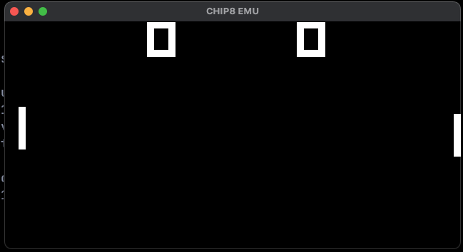
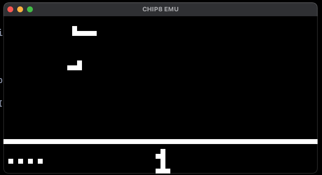

# CHIP-8 Emulator in Rust

A simple, cross-platform CHIP-8 emulator written in Rust. This project aims to provide a clean, idiomatic, and educational implementation of the classic CHIP-8 virtual machine, including graphics, keyboard, and sound support.

## Features

- Full CHIP-8 instruction set support
- 64x32 monochrome display with scaling
- Keyboard input mapping
- 8-bit delay and sound timers
- Beep sound when the sound timer is active
- Modular, idiomatic Rust codebase

## Getting Started

### Prerequisites

- [Rust](https://www.rust-lang.org/tools/install) (latest stable recommended)
- [Cargo](https://doc.rust-lang.org/cargo/getting-started/installation.html)
- [rodio](https://crates.io/crates/rodio) (audio backend, added as a dependency)

### Building

Clone the repository:

```sh
git clone https://github.com/yourusername/chip8emu.git
cd chip8emu
```

Build the project:

```sh
cargo build --release
```

### Running

To run the emulator with a CHIP-8 ROM:

```sh
cargo run --release -- path/to/your_rom.ch8
```

### Controls

- CHIP-8 keys are mapped to your keyboard (see `src/keyslog.rs` for details).
- Press `Esc` or close the window to exit.

## Project Structure

- `src/cpu.rs` — CPU, registers, and timer logic
- `src/memory.rs` — Memory and fontset
- `src/instructions.rs` — Instruction decoding and execution
- `src/display.rs` — Display rendering and main loop
- `src/audio.rs` — Sound timer and beep playback
- `src/emu8.rs` — Emulator initialization
- `src/keyslog.rs` — Keyboard mapping

## Screenshots




## Credits

- [CHIP-8 technical reference](http://devernay.free.fr/hacks/chip8/C8TECH10.HTM)
- [rodio](https://github.com/RustAudio/rodio) for audio playback

## License

This project is licensed under the MIT License. See [LICENSE](LICENSE) for details.

---

*Happy emulating!*

